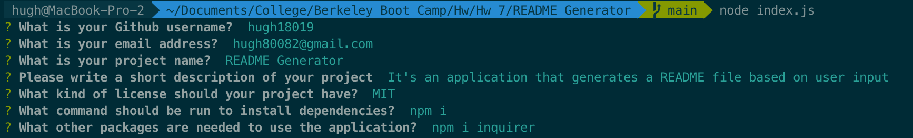

## h 
  h

  ## Installation
  Run the following command to install all dependencies.
  > h

  Run the following command to install the required inquirer package.
  > h

  ## Usage
  First navigate to the root of the project directory.
  Then run the command "node index.js".
  Then answer each prompt.

  

  ## Contributors
  > h 
  > h
  
  ## License
  > 
  https://opensource.org/licenses/MIT

  